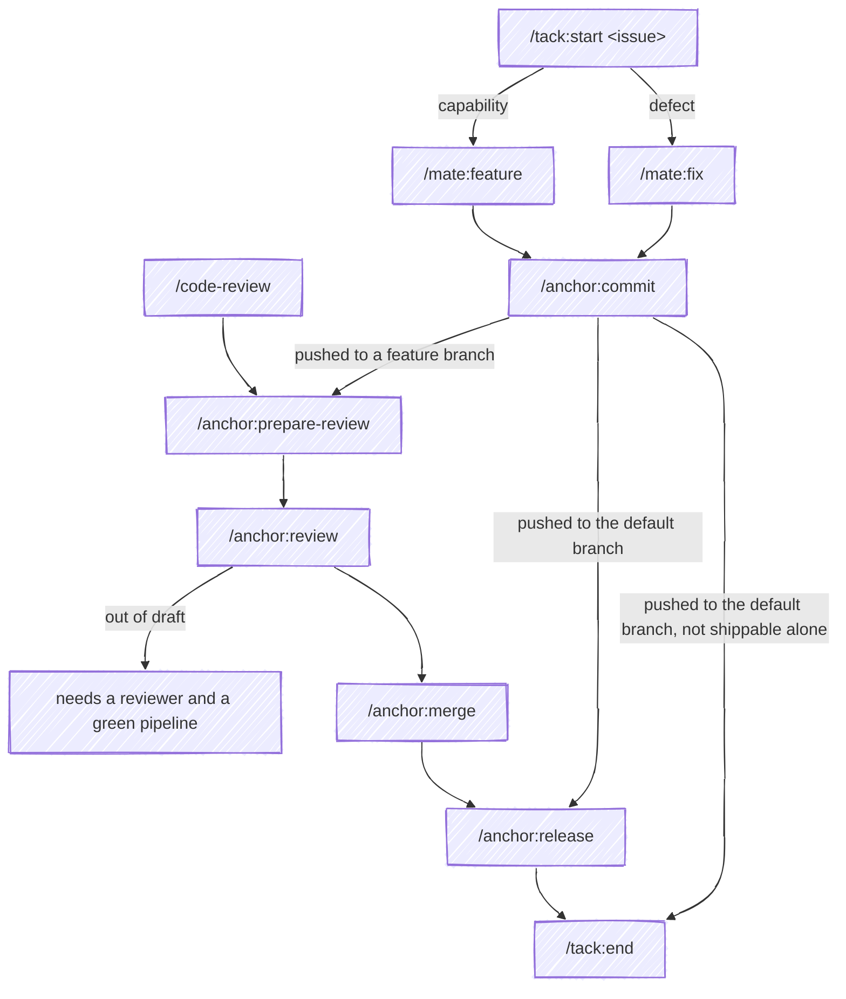

# Workflow

mate watches for two things: a phase starting, and a sibling plugin announcing
what it just did. Each one maps to a single line naming what comes next. mate
never runs that step; you type it, or you don't.

There is no state machine behind it. mate doesn't track which phase you're in or
what it told you earlier. Every line comes from the one event in front of it, so
entering the same phase twice gets the same line twice. The only memory is a
one-shot marker that stops an announcement from being answered twice.

## How mate knows a phase is done

Claude Code fires no event when a skill finishes, so mate can't see a phase end
on its own. Every transition rests on one of three signals, and they aren't
equally strong:

- <strong>●●● Observed.</strong> A sibling announces what happened after it happened, carrying
  the facts (a sha, a branch, a URL). mate reads the announcement, so the line
  can't arrive early.
- **●●○ Announced, not read.** A sibling announces it, but tack records it and mate
  doesn't subscribe. The line comes from the phase starting instead.
- **●○○ The agent's judgment.** Nothing announces it. mate's line fires when the
  phase starts and says what to do *once it's done*; the agent decides when that
  is, and nothing checks.

| Transition | Signal | What decides it |
|------------|--------|-----------------|
| `/anchor:commit` → `/anchor:prepare-review`, `/anchor:release`, or `/tack:end` | <strong>●●● Observed</strong> | anchor's `commit.pushed`, after the push lands, with the branch it landed on |
| Out of draft → a reviewer and the pipeline | <strong>●●● Observed</strong> | anchor's `cr.ready`, with the change request's URL |
| `/anchor:prepare-review` → `/anchor:review` | ●●○ Announced, not read | anchor's `cr.created` |
| `/anchor:merge` → `/anchor:release` | ●●○ Announced, not read | anchor's `cr.merged` |
| `/anchor:release` → `/tack:end` | ●●○ Announced, not read | anchor's `release.created` |
| `/tack:start` → `/mate:fix` or `/mate:feature` | ●○○ The agent's judgment | the agent reads the issue's labels and description |
| `/mate:fix` or `/mate:feature` → `/anchor:commit` | ●○○ The agent's judgment | the agent decides the tree is green; `/anchor:commit` runs the tests again before it commits |
| `/code-review` → `/anchor:prepare-review` | ●○○ The agent's judgment | the agent decides the findings are settled |
| `/anchor:review` → `/anchor:merge` | ●○○ The agent's judgment | the agent decides someone is looking at the change request |

Where the signal is the agent's judgment, a phase you abandon partway still
leaves its next-step line in the conversation. The line is worded as a
condition, so it reads as advice for later rather than an instruction now.

## When a phase starts

These fire the moment you type the command, or the agent invokes the skill.
The line says what to run once the phase is done.

### `/tack:start`

**Then:** mate asks the agent to read the linked issue's labels and description,
decide whether it's a defect or a capability, and say which skill fits:

- a defect whose cause isn't known yet → `/mate:fix`
- a capability the codebase doesn't have → `/mate:feature`

The agent names one; it doesn't start it.

### `/mate:fix` or `/mate:feature`

**Then:** `/anchor:commit`, once the tree is green.

### `/anchor:commit`

**Then:** nothing yet. What comes next depends on where the commit lands, which
isn't known until the push. See [When a commit is pushed](#when-a-commit-is-pushed).

### `/code-review`

**Then:** `/anchor:prepare-review`, once the findings are settled.

### `/anchor:prepare-review`

**Then:** `/anchor:review` over your own change. The change request opens as a
draft, and the self-review ends by offering to take the draft flag off.

### `/anchor:review`

**Then:** `/anchor:merge`, once the change request is out of draft and someone
is looking at it.

### `/anchor:merge`

**Then:** `/anchor:release`, if the change is shippable on its own.

### `/anchor:release`

**Then:** `/tack:end`.

## When a sibling announces something

These fire when anchor reports what a command did. They carry facts a phase name
can't: the branch a commit landed on, and the change request's URL.

### When a commit is pushed

anchor announces this only after `/anchor:commit` has pushed, and it commits only
on an approved review. So the diff has already been read, and mate never
suggests reviewing it again.

- **If** it landed on a feature branch, **then** `/anchor:prepare-review` to
  open the change request.
- **If** it landed on the default branch, **then** there's no change request to
  open: `/anchor:release` if it's shippable alone, otherwise `/tack:end`.
- **If** the repo's default branch can't be worked out, **then** mate says
  nothing rather than guess.

Once per commit: pushing the same sha again stays quiet, and an amend is a new
commit.

### When a change request leaves draft

**Then:** mate names what it still needs:

- a reviewer: assign one, or send the URL to whoever should look
- the pipeline: report where it stands

Once per session.

## When nothing matches

Every other command, prompt, and tool call gets no output at all. mate matches a
command only at the start of your prompt, so mentioning `/anchor:merge`
mid-sentence doesn't trigger it. It matches the bare names `code-review`, `fix`,
and `feature`; every other phase has to be namespaced (`anchor:merge`, not
`merge`), so a different plugin's `merge` skill doesn't get a nudge about this
workflow.

The full set of rules, each with an ID, is in [Requirements](/spec).
